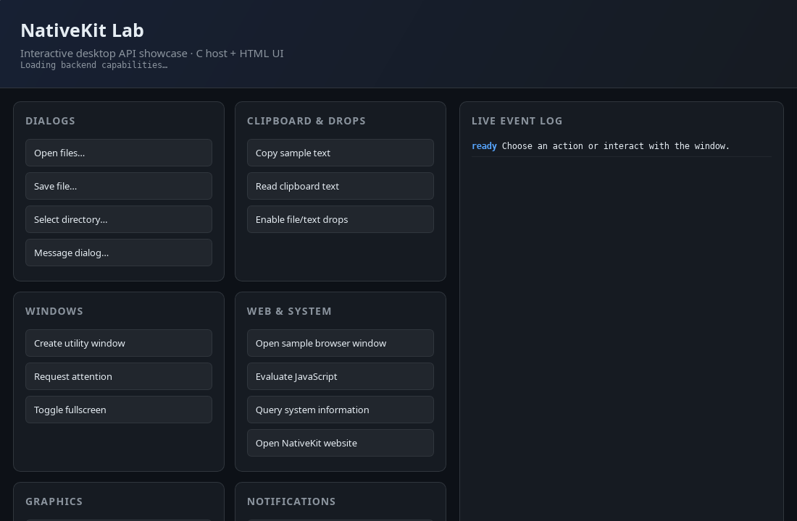

# NativeKit 🧰

**Cross-platform native capabilities behind one compact C ABI.**

NativeKit gives runtimes, language bindings, and lightweight applications access
to windows, WebViews, dialogs, graphics surfaces, input, system services, and
mobile hosts without exposing a C++ application framework. The API is handle
based, UTF-8 throughout, and designed around an explicit event queue.

> [!IMPORTANT]
> NativeKit is experimental and its pre-1.0 ABI is still evolving. It is ready
> for exploration and integration work, not yet for compatibility-critical
> production deployments.

## ✨ See it in action

| NativeKit Lab | OpenGL surface |
|:---:|:---:|
| [](docs/images/nativekit-showcase.png) | [](docs/images/nativekit-opengl.png) |
| Dialogs, clipboard, notifications, windows, WebViews, and a live event log | A responsive native graphics surface rendered through the C API |

These are real captures from the Linux samples. NativeKit uses the corresponding
native services on Windows, macOS, and Android.

## 🚀 Why NativeKit?

- **Small C boundary** — straightforward to call from C, C++, Haxe, Rust, and
  other FFI-capable languages.
- **Native where it matters** — Win32 and WebView2, GTK and WebKitGTK, Cocoa and
  WKWebView, and Android platform views.
- **One asynchronous model** — dialogs, WebViews, clipboard reads,
  notifications, drops, and lifecycle changes arrive through one event queue.
- **Safe opaque handles** — generation-checked handles reject stale resources.
- **Graphics-ready** — OpenGL, OpenGL ES, and Vulkan presentation surfaces,
  with explicit capability discovery.
- **Interop-friendly** — desktop applications can export native window
  descriptors when they need a platform escape hatch.

## 🗺️ Platform feature matrix

This overview groups related API capabilities to keep platform support easy to
scan. Applications should still query `nk_get_capabilities()` at runtime:
optional system components and build configuration can affect availability.

| Feature family | Linux | Windows | macOS | Android | Web / WASM |
|---|:---:|:---:|:---:|:---:|:---:|
| Windows and lifecycle | ✅ | ✅ | ✅ | Host view | Partial |
| WebView | ✅ | ✅ | ✅ | ✅ | 🚧 |
| Dialogs and system services | ✅ | ✅ | ✅ | ✅ | 🚧 |
| Clipboard and drag/drop | ✅ | ✅ | ✅ | ✅ | 🚧 |
| Notifications | ✅ | ✅ | ✅ | ✅ | 🚧 |
| Input, cursors, and capture | ✅ | — | — | Partial | Partial |
| Monitors and fullscreen modes | ✅ | — | — | — | — |
| Joysticks and gamepads | ✅ | — | — | ✅ | 🚧 |
| OpenGL / OpenGL ES | ✅ | — | — | GLES | Partial |
| Vulkan | ✅ | — | — | ✅ | 🚧 |
| URI resources and sharing | Partial | Partial | Partial | ✅ | 🚧 |
| Custom-surface accessibility | — | — | — | ✅ | 🚧 |
| Native interoperability | Export | Export | Export | Host view | — |

**Legend:** ✅ supported · **Partial** a subset is supported · 🚧 coming soon ·
— not currently advertised

- Linux desktop support requires GTK 3 and WebKitGTK 4.1. Without them, the
  library builds with a stub backend and reports the services as unsupported.
- Windows WebViews require the Microsoft Edge WebView2 Evergreen Runtime.
  The pinned WebView2 SDK is fetched at configure time unless
  `-DNK_ENABLE_WEBVIEW2=OFF` is used.
- Android attaches to a caller-owned `ViewGroup`; it deliberately does not
  create or own an `Activity` or desktop-style top-level window.
- Capability bits describe complete API groups. Some common window operations
  are available on desktop backends even where the broader extended geometry or
  styling groups are not advertised.
- See the [API guide](docs/api.md) and `NK_CAP_*` declarations in
  [`nativekit_window.h`](include/nativekit_window.h) for exact capability-level
  details.

## 🏗️ Build from source

Clone the repository:

```sh
git clone https://github.com/tritao/nativekit.git
cd nativekit
```

The optional Sokol and UI modules use pinned Git submodules. Initialize them
only when building those modules:

```sh
git submodule update --init
```

Configure, build, and test a desktop build with CMake:

```sh
cmake -S . -B build -GNinja -DCMAKE_BUILD_TYPE=Debug
cmake --build build
ctest --test-dir build --output-on-failure
```

Experimental higher-level modules live in the same repository but remain
optional so the core platform library stays compact. Enable the low-level Sokol
adapter with `-DNK_BUILD_SOKOL=ON`, or the retained UI-engine scaffold with
`-DNK_BUILD_UI=ON`. Their design and build notes live under [`modules/`](modules/).

### Web / WASM preview

The initial browser backend is Emscripten + WebGL2 behind NativeKit's regular
window, surface, input, and frame-callback APIs. Set it up and build the
browser UI showcase with:

```sh
./tools/setup-web.sh
./tools/build-web.sh
./tools/test-web.sh
./tools/benchmark-web-haxeon.sh
python3 -m http.server --directory build-web/modules/ui 8080
```

Then open `http://localhost:8080/nativekit_ui_c_api.html`. Add `?smoke` to run
the 30-frame browser smoke test. The generated web host is an example/deploy
shell; Emscripten remains private to the platform implementation.

The same Showcase source can also be compiled through Haxeon’s wasm32 backend:

```sh
./modules/ui/tools/showcase-wasm.sh
```

This produces a validated guest module and portable wasm32 HXI contracts. A
browser host bridge is still required to connect those imports to Emscripten’s
NativeKit runtime.

The browser benchmark warms up the Haxeon Showcase, measures 600 rendered
frames by default, and writes startup timings, frame-time percentiles, dropped
frames, artifact sizes, and shared-memory size to
`out/benchmark-web-haxeon.json`. Override the run length with
`NATIVEKIT_WEB_BENCHMARK_WARMUP` and `NATIVEKIT_WEB_BENCHMARK_FRAMES`.
The default runner uses headless Chrome with software WebGL for repeatability;
its frame cost is useful for regressions, while its estimated dropped-frame
count should not be treated as production GPU pacing.

The Android library, sample applications, and Gradle wrapper live under
[`android/`](android/). See the [Android guide](android/README.md) for SDK/NDK,
host lifecycle, and instrumentation-test instructions.

## 🎮 Samples

After a desktop build, try:

```sh
# Embedded HTML, responsive WebView bounds, and page-to-native JSON
./build/examples/nativekit_hello

# Navigation policy, page titles, failures, and an optional starting URL
./build/examples/nativekit_browser https://example.com

# Interactive tour of the desktop API
./build/examples/nativekit_showcase

# Responsive OpenGL triangle
./build/examples/nativekit_opengl

# Vulkan device, swapchain, pipeline, and resize handling
./build/examples/nativekit_vulkan
```

The Vulkan sample is built when Vulkan development files and `glslc` are
available. Both graphics samples accept `--smoke-test`; they render 30 frames,
exercise resize handling, and exit. CTest runs them under Xvfb when available.

## 🧭 API model

NativeKit intentionally stays below the widget-toolkit layer:

- UI APIs are main-thread-only unless their documentation says otherwise.
- Resources are opaque, generation-checked `nk_handle` values.
- Top-level windows can form a small ownership tree for utility and modal
  windows, but NativeKit does not provide panels, controls, or layout widgets.
- WebView creation may be asynchronous. Calls issued before
  `NK_EVENT_WEBVIEW_READY` are retained in order.
- Navigation policy is opt-in; proposed navigations become request events that
  the application explicitly allows or cancels.
- JavaScript results and page messages are compact UTF-8 JSON on every backend.
- Event payloads returned by `nk_poll_event()` must be released with
  `nk_event_release()`.

The public headers in [`include/`](include/) are the normative API reference.
See [the API guide](docs/api.md) for threading, ownership, event payloads, URI
resources, text input, graphics, and accessibility. The latest consistency and
ABI audit is recorded in [the API review](docs/api-review.md).
Use the [API documentation audit](docs/api-doc-audit.md) to inventory missing
comments in C declarations and generated HXI surfaces.

## 🧪 Testing

The normal CTest suite covers the public C ABI, core lifetime rules, and the host
backend. Platform CI additionally covers:

- Linux GUI and graphics tests under Xvfb, plus sanitizer builds.
- Native Windows x64/x86 tests and ARM64 cross-compilation.
- An isolated MinGW/Wine compatibility suite via `tools/test-wine.sh`.
- Native Intel and Apple Silicon macOS builds.
- Android unit and instrumentation tests.
- Generated Haxeon binding drift and runtime smoke tests.

See [the testing guide](docs/testing.md) for prerequisites, exact coverage, and
the distinction between compatibility-layer and authoritative native tests.

## 🧹 Development

Source formatting is defined by `.clang-format`:

```sh
cmake --build build --target format
cmake --build build --target format-check
```

## 📍 Project status

NativeKit is under active development. The feature matrix documents what the
current backends advertise, while runtime capability checks remain the contract
applications should trust. Contributions, portability reports, and focused
backend tests are welcome.

## 📄 License

NativeKit is available under the [Apache License 2.0](LICENSE). Third-party
components retain their respective licenses.
